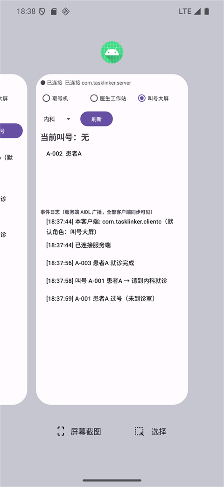
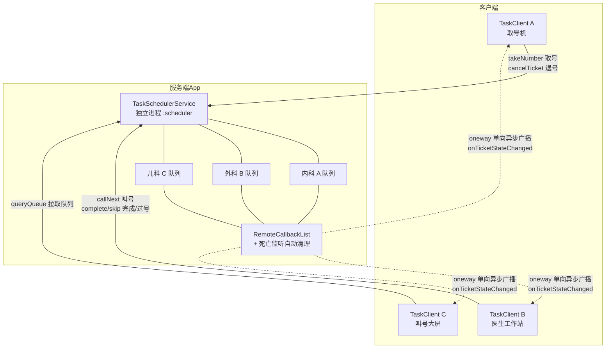
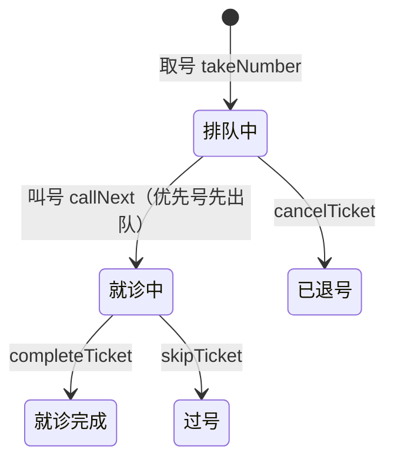
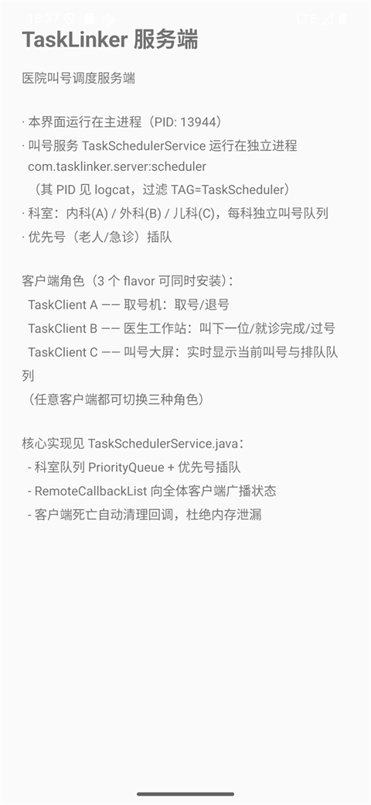
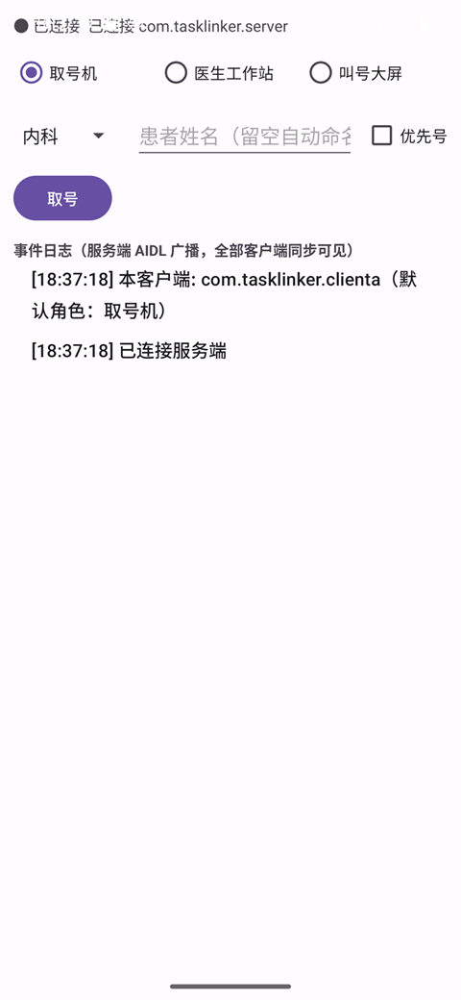
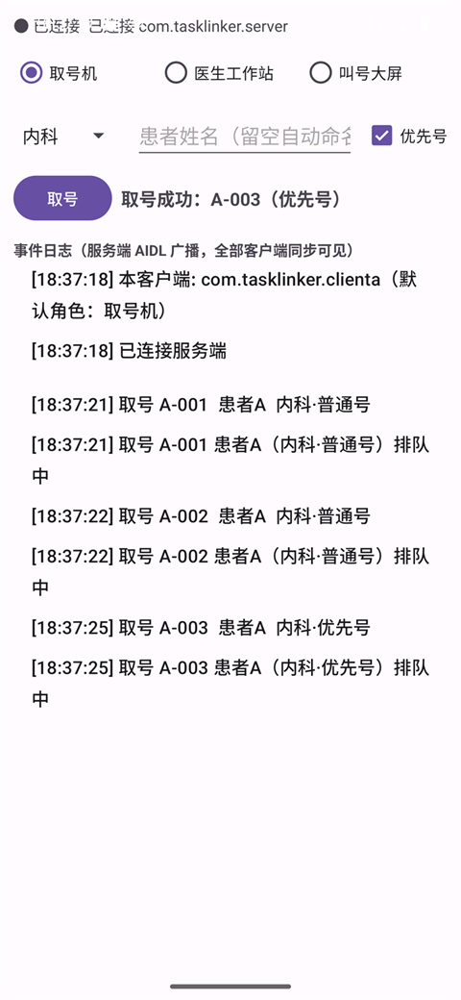
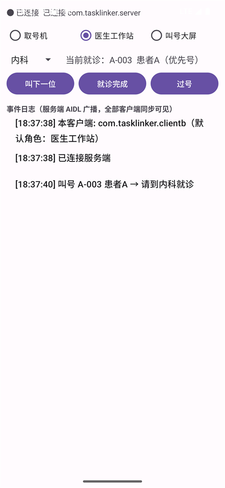
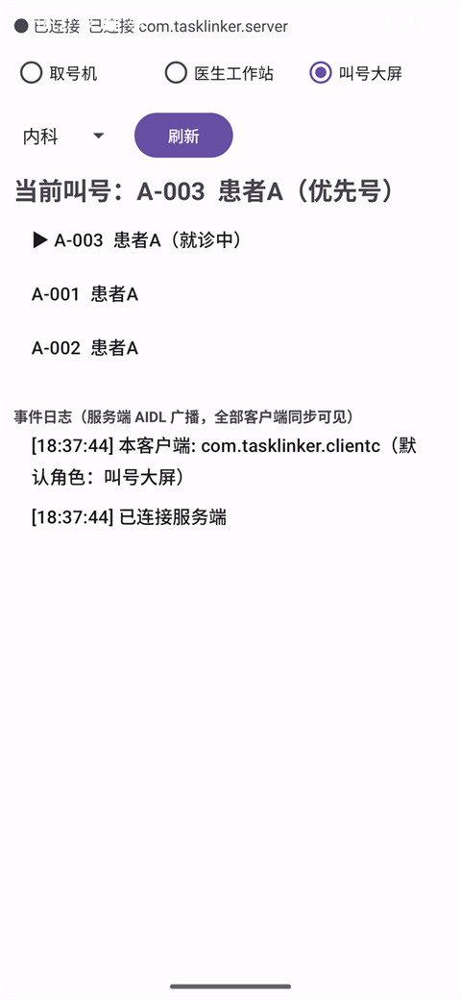
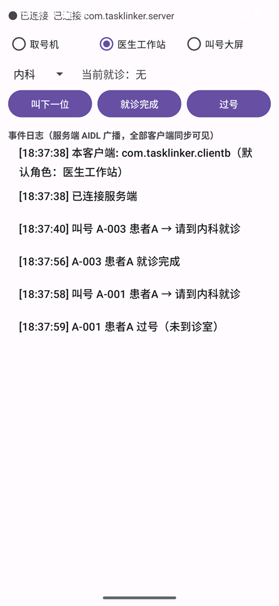
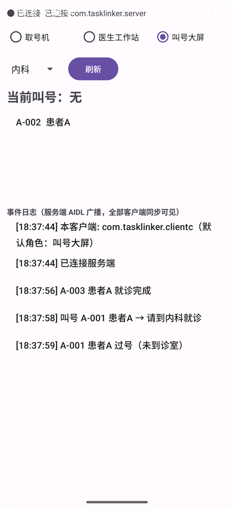

<!-- 发布说明（发布前删除本注释）：
1. 请把 docs/images/ 下的 8 张截图依次上传到掘金图床（编辑器内直接粘贴即可）；
2. 将文中 images/xx.png 的相对路径替换为上传后的图床 URL；
3. 建议标签：Android、AIDL、Binder、架构；
4. 文末"源码地址"请替换为你自己的仓库链接。 -->

# 用 AIDL 手写一个跨 App 医院叫号系统：3 个客户端实时联动

> 一套完整的 Android 跨进程通信实战：服务端独立进程 + 取号机/医生站/叫号大屏三个独立 App，通过 AIDL 实时联动。优先号插队、叫号广播、断线重连、客户端死亡清理，全部手写实现。

想象一下医院门诊大厅：患者在取号机上取号，医生在工作站上叫号，候诊大厅的大屏实时跳动——这三类终端在现实中就是**三台设备、三个 App**，共享同一个叫号中心。这恰好是 Android 跨进程通信（AIDL）最经典的落地场景。

我把这套系统完整实现了一遍，4 个 App 同时跑在一台模拟器上：



读完这篇文章，你将掌握：

- ✅ AIDL 完整工程实践：接口设计、Parcelable 序列化、共享模块的组织方式
- ✅ RemoteCallbackList 多客户端回调管理，客户端进程被杀自动清理，杜绝内存泄漏
- ✅ 优先级队列调度（优先号插队）与线程安全设计
- ✅ 客户端连接管理：显式 Intent 绑定、linkToDeath、指数退避重连
- ✅ 4 个只有真动手才会踩到的坑

## 一、系统设计

### 1.1 为什么是"服务端 + 多客户端"

先澄清一个常见误解：**AIDL 的边界是"进程"，不是"App"**。只要调用方和被调用方在不同进程，就需要 AIDL；拆不拆成两个 App 只是业务形态问题。医院叫号恰好是典型的**多终端场景**——取号机、医生站、大屏本来就是不同设备，所以拆成独立 App 是最真实的设计，也是 3 个客户端"同时连接"的意义所在。

### 1.2 架构总览



工程结构上分三个 Gradle 模块：

- **tasklinker-api**：共享 AIDL 接口库——两端必须持有"包名 + 类名"完全一致的接口定义，放进共享模块从机制上杜绝两端不一致；
- **server**：服务端 App，调度服务运行在独立进程 `:scheduler`；
- **app**：客户端 App，用 3 个 productFlavor（clientA/B/C，applicationId 不同）打出 3 个可同时安装的终端 App。

### 1.3 排队号状态机



两个关键约束：
- **一科一诊室**：当前患者未"完成/过号"时，`callNext` 返回 -1，保证交互闭环；
- **只有排队中可退号**：就诊中的号只能由医生操作收尾。

## 二、AIDL 接口设计：把契约写进共享模块

### 2.1 调度接口 ITaskScheduler

```aidl
// tasklinker-api/src/main/aidl/com/tasklinker/api/ITaskScheduler.aidl
interface ITaskScheduler {
    int  takeNumber(in TicketInfo ticket);              // 取号，返回 ticketId
    int  callNext(String department);                   // 叫下一位，返回被叫 ticketId
    boolean completeTicket(int ticketId);               // 就诊完成
    boolean skipTicket(int ticketId);                   // 过号
    boolean cancelTicket(int ticketId);                 // 退号（仅排队中）
    TicketInfo queryTicket(int ticketId);               // 单号查询快照
    List<TicketInfo> queryQueue(String department);     // 科室队列：首位为正在就诊
    void registerCallback(ITaskCallback callback);
    void unregisterCallback(ITaskCallback callback);
}
```

这些方法由服务端的 **Binder 线程池**并发执行——三个客户端可能同时操作同一个科室队列，服务端实现必须线程安全（下文细说）。

### 2.2 状态回调 ITaskCallback：为什么是 oneway

```aidl
oneway interface ITaskCallback {
    void onTicketStateChanged(in TicketInfo ticket);
}
```

`oneway` 声明回调为**单向异步事务**：服务端发完即走，不会被某个卡死的客户端阻塞。如果没有 oneway，一个响应缓慢的客户端就会把服务端工作线程拖住，进而拖垮对**所有**客户端（大屏、医生站）的广播。代价是 oneway 失败不抛远程异常，失效回调的清理交给 RemoteCallbackList 内部的死亡监听兜底。

### 2.3 TicketInfo：跨进程的按值传递

| 字段 | 类型 | 说明 |
|---|---|---|
| ticketId | int | 服务端统一分配（客户端传值被覆盖） |
| ticketNo | String | 叫号号码 "A-003"（科室前缀 + 递增序号） |
| patientName | String | 患者姓名 |
| department | String | 内科 / 外科 / 儿科 |
| priority | int | 普通号=1 / 优先号=3 |
| createTime | long | 取号时间戳，同优先级先来先叫 |
| state | int | 排队中/就诊中/完成/过号/退号 |

注意一个认知点：AIDL 传的不是对象引用，而是**序列化后的拷贝**——客户端手里的 TicketInfo 和服务端的是两个独立对象，所以查询接口返回的都是 `copy()` 快照，避免读到并发中间态。

## 三、服务端核心实现

### 3.1 科室队列模型

```java
private static class DepartmentQueue {
    final String department;
    final String prefix;                            // A/B/C
    final PriorityQueue<TicketInfo> waiting;        // 等待队列
    final AtomicInteger counter = new AtomicInteger(1);
    TicketInfo current;                             // 当前就诊（一科同时一位患者）
}
```

### 3.2 优先号插队：比较器必须全序

```java
private static final Comparator<TicketInfo> TICKET_COMPARATOR = (a, b) -> {
    int byPriority = b.priority - a.priority;          // 1. 优先号先叫
    if (byPriority != 0) return byPriority;
    int byTime = Long.compare(a.createTime, b.createTime); // 2. 先来先叫
    if (byTime != 0) return byTime;
    return a.ticketId - b.ticketId;                    // 3. 兜底保证全序
};
```

第三级比较看着多余，实则关键：**PriorityQueue 的比较器返回 0 会让两个元素被判"相等"，导致丢号**。任何优先级队列都必须保证比较器全序，这是最容易被忽略的坑。

### 3.3 锁的边界：状态转换在锁内，广播在锁外

每个 `DepartmentQueue` 对象本身即锁：

```java
public int callNext(String department) {
    DepartmentQueue q = departments.get(department);
    TicketInfo called;
    synchronized (q) {                        // 锁内：状态机转换
        if (q.current != null) return -1;     // 当前患者未处理完
        called = q.waiting.poll();
        if (called == null) return -1;        // 队列为空
        called.state = TicketState.CALLING;
        q.current = called;
    }
    broadcast(called);                        // 锁外：Binder 广播
    return called.ticketId;
}
```

为什么广播必须在锁外？广播是对多个远程客户端的 Binder 调用，即使 oneway 不阻塞，**持锁做任何耗时操作都会放大锁竞争**。锁只保护状态机，通信永远在外面。

### 3.4 RemoteCallbackList：多客户端回调与死亡清理

```java
private static class TicketCallbacks extends RemoteCallbackList<ITaskCallback> {
    @Override
    public void onCallbackDied(ITaskCallback callback, Object cookie) {
        // 客户端进程被杀 → 回调 Binder 死亡 → 自动移除后回调此方法
        Log.w(TAG, "client '" + cookie + "' died, callback removed automatically");
    }
}
```

两个要点：

1. **自动清理**：RemoteCallbackList 内部为每个回调注册了 `IBinder.DeathRecipient`，客户端进程被杀后回调自动移除，不持有失效 Binder，无内存泄漏；
2. **广播期间不能 unregister**：`beginBroadcast()/finishBroadcast()` 期间调用 unregister 会抛异常，所以广播中发现的死回调先记入队列，广播结束后统一移除。

服务端主界面（核心逻辑都在 logcat 的独立进程里）：



## 四、客户端实现

### 4.1 三种角色，一个 App

3 个 flavor 默认角色不同（顶部可随时切换）：TaskClient A 是取号机、B 是医生工作站、C 是叫号大屏。



### 4.2 连接管理：三条断线路径 + 指数退避

```java
// 服务端进程被杀的三条感知路径，统一收敛到 handleDisconnect
public void onServiceDisconnected(ComponentName name) { ... }  // 服务崩溃
public void onBindingDied(ComponentName name) { ... }          // API 26+
IBinder.DeathRecipient binderDied = () -> { ... };             // linkToDeath

// 重连：1s → 2s → 4s → 8s → 10s 封顶，连上即清零
long delay = Math.min(10000L, 1000L << Math.min(reconnectAttempt, 4));
```

注意：主动 `unbindService` 不会触发上面任何一条回调，所以重连只发生在**真异常**时，不会出现"正常断开却在疯狂重连"的尴尬。

### 4.3 回调线程切换

`ITaskCallback.Stub` 的方法运行在**客户端进程的 Binder 线程池**，严禁直接碰 UI：

```java
private final ITaskCallback.Stub taskCallback = new ITaskCallback.Stub() {
    @Override
    public void onTicketStateChanged(TicketInfo ticket) {
        mainHandler.post(() -> listener.onTicketStateChanged(ticket)); // 切回主线程
    }
};
```

## 五、跑一遍完整流程

**第 1 步：取号。** 取号机（客户端 A）给内科连取 3 个号，第三个勾选"优先号"（模拟老人/急诊）：



**第 2 步：叫号。** 医生工作站（客户端 B）点"叫下一位"——注意被叫的是 **A-003**，优先号插队成功，排在 A-001/A-002 前面：



**第 3 步：大屏实时刷新。** 切换到叫号大屏（客户端 C），无需任何操作——取号、叫号的每一次广播它都收到了，界面已是实时状态：



**第 4 步：完成与过号。** 医生依次操作：A-003 就诊完成 → 叫下一位（A-001）→ 患者未到，点"过号"：



**第 5 步：回到大屏。** 全程大屏都在后台保持连接、持续接收广播，回到前台显示的就是最终真实状态：当前叫号无，队列只剩 A-002：



到这里，一轮完整的医院叫号交互闭环就完成了：取号 → 排队 → 优先插队 → 叫号 → 完成/过号，每一步都通过 AIDL 在 4 个 App 之间实时同步。

## 六、踩坑实录（真踩过才写）

1. **AGP 9 默认不编译 AIDL**：`.aidl` 文件被静默忽略，报"找不到符号 ITaskScheduler"。三个模块都要显式开启 `buildFeatures { aidl = true }`，查这个坑浪费了我不止一小时；
2. **onCallbackDied 挂错类**：它是 `RemoteCallbackList` 的死亡钩子，必须**子类化** RemoteCallbackList 重写，写在 Service 上 `@Override` 直接编译失败；
3. **广播期间不能 unregister**：`beginBroadcast` 期间调用 unregister 抛 IllegalStateException，死回调要先记账、广播结束后统一清理；
4. **大屏数据陈旧之谜**：第一版把连接绑定在 Activity 的 onStart/onStop 上，大屏切到后台就断连，回到前台显示的还是老数据。教训：**终端类应用（大屏/取号机）连接要常驻**——绑定生命周期放到 onCreate/onDestroy，重连成功后从服务端 `queryQueue` 重新同步一次本地缓存。

## 七、验证清单

| 场景 | 操作 | 预期 |
|---|---|---|
| 3 客户端同时连接 | 同时打开 A/B/C | 均"● 已连接"，服务端 logcat 显示 registerCallback×3 |
| 优先号插队 | 第 3 个号勾"优先号" | 医生叫号先叫 A-003，大屏队列中排最前 |
| 广播到全体 | 任一客户端操作 | 三个客户端日志同步出现同一事件 |
| 交互闭环 | 患者未处理完时点"叫下一位" | 被拒（-1），必须先完成/过号 |
| 客户端被杀 | `adb shell am force-stop com.tasklinker.clienta` | 服务端 logcat 打印 died 日志，B/C 不受影响 |
| 服务端被杀 | `adb shell am force-stop com.tasklinker.server` | 三个客户端按 1s/2s/4s/8s/10s 退避自动重连 |

## 总结

这个项目麻雀虽小，五脏俱全：AIDL 接口设计、Parcelable 序列化、oneway 异步回调、RemoteCallbackList 死亡清理、优先级队列调度、锁边界、断线重连——Android IPC 的核心工程实践基本都覆盖了。理解了这个系统，再去看系统服务（ActivityManagerService、NotificationManagerService 其实都是 Binder 服务，你的 App 每天都在当"客户端"）会豁然开朗。

源码地址：<待补充>

可继续深挖的方向：叫号超时自动过号（ScheduledExecutorService）、多诊室并发叫号、过号重排回队尾、叫号语音播报。
